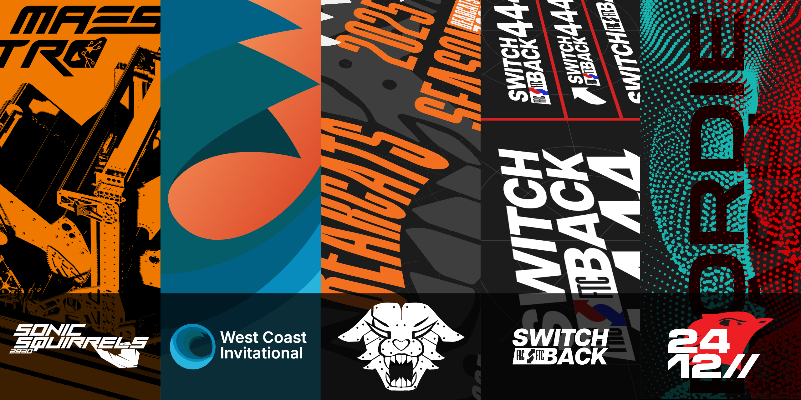

# Open Graphics by Aiden Powers
Public graphic design resources for my work.

### "Some designs you show online are missing, where are they?"
I am in the process of converting my previous designs (that include Adobe fonts) to an open standard. I cannot guarantee that all my designs will become public.

### "What does "open design" or "open standard" mean?"
I see an open design as mainly an svg file, or another common format editable by the majority of existing design software. In addition, I also believe designs should use fonts that are free or open source. (think google fonts, open foundry, etc.)